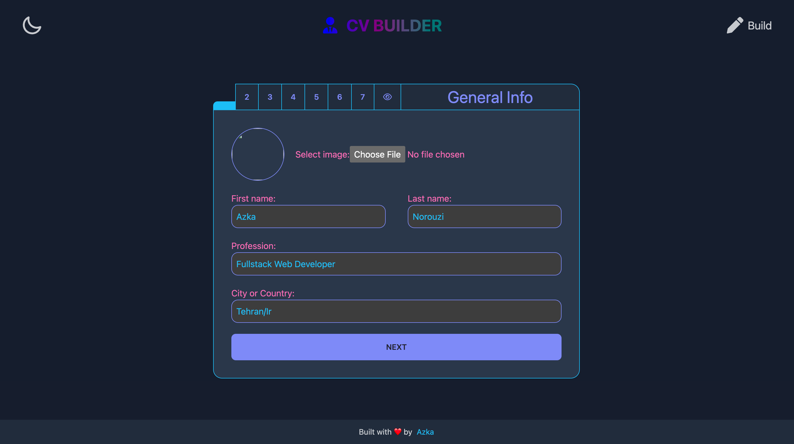
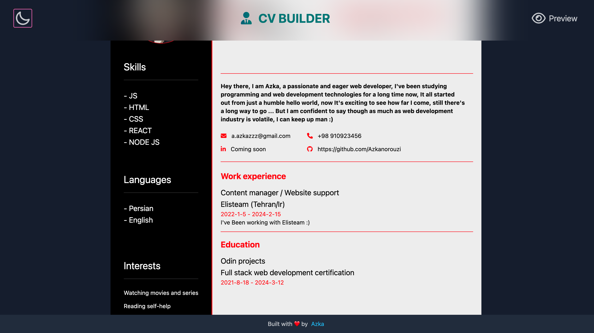

# CV-builder

demo: [https://react-cvbuilder.netlify.app/](https://react-cvbuilder.netlify.app/)

Hey there this is me AZKA 🙋‍♂️

and this is React CVBuilder which allows you to create your very own resume in a blink of an eye, you can upload your information to build your resume quick and easy, I also included a nice dark/light mode functionality, ngl themes are my favorite part of front-end projects ;).

✏️ How to use it:

- Note: you can go to different parts of the form by clicking on your number keys if you're using a keyboard, also you can easily share your resume with the exact colors of your choice for anyone thanks to react router.

- Upload your information and complete each step (image, education data, working experience, skills, habits ...)
- After you're done you'll be automatically navigated to /resume page
- Inside /resume you can change the accent color and background colors as you wish
- After you're done coloring things up, now it's time to click on "Save as pdf" button to download your resume

🔴 Things i learned:
1- React router
2- Memoization
3- Context api (I was getting tired of doing prop drilling 😁)
4- Reducer hook

🤔 further improvements:

- Make resume much more flexible and customizable so that user can change layout change font-family for the resume and ...
- Making mobile version better looking
- Preserving the chosen color-state after user switches back from /resume to /build
- Adding a landing page
